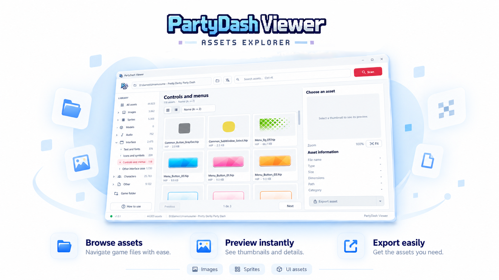
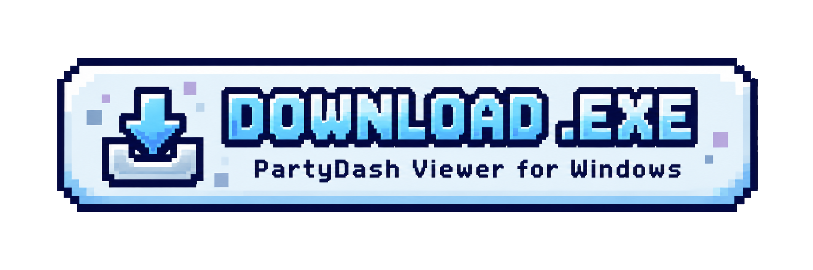

<div align="center">

# PartyDash Viewer

Local asset explorer for **Umamusume: Pretty Derby – Party Dash** on Windows. The application reads the game installation, builds a searchable library, and lets you preview or export recognized files.



<a href="https://github.com/linwaru/PartyDash-Viewer/releases">
  
</a>

</div>

## Features

| Feature                   | Description                                                                          |
| ------------------------- | ------------------------------------------------------------------------------------ |
| **Automatic detection**   | Searches for game installations, including Steam libraries and the last folder used. |
| **Searchable catalog**    | Organizes files by name, type, size, and category.                                   |
| **Preview**               | Displays recognized images and information about the selected asset.                 |
| **Collection navigation** | Quickly access characters, images, sprites, UI, models, audio, and other files.      |
| **Recognized packages**   | Lists internal items from supported packages when found.                             |
| **Exporting**             | Save images, decoded content, or detailed information in appropriate formats.        |
| **Media playback**        | Open supported audio and video files directly in the Viewer.                         |

## Before You Start

* You must have the game installed with the required data already downloaded.
* This project does not include or redistribute game files.
* The Viewer works locally: the original installation is read but not modified. Exports are saved as copies to the destination you choose.
* Asset classification is automatic; some files may appear under **Unidentified** or in incorrect category when their format or filename does not allow for reliable classification.

## Download and Installation

1. Download `PartyDashViewer-v<version>-Windows-x64.zip` from the [Releases](https://github.com/linwaru/PartyDash-Viewer/releases) page.
2. Extract the ZIP file to a folder of your choice. No installation is required.
3. Run `PartyDashViewer.exe`.
4. Wait for the automatic search for the game installation. If no installation is found, open **Game Folder** and select the folder manually.
5. If the application asks for a new scan, click **Scan** or press `F5`.

## Finding the Correct Folder

In Steam, open **Library → Umamusume: Pretty Derby – Party Dash → Manage → Browse Local Files**.

Select the folder containing the game installation and an `asset` subfolder with `.bin` files, for example:

```text
Game Folder/
├─ Uma Party Dash.exe
└─ asset/
   ├─ 00000000000000000000000000000000.bin
   └─ ...
```

You can also select the `asset` folder directly. The Viewer attempts to automatically locate recent installations, the last folder used, Steam libraries, and installations registered in Windows.

## How to Use

1. Connect the game folder and wait for the catalog to be created.
2. Choose a collection from the sidebar or use search to filter by name.
3. Select an asset to open its preview and view its name, format, size, path, and category.
4. In image previews, use the mouse wheel to zoom and drag to move the image. Use `0` to fit it to the window and `1` to display it at its actual size.
5. Use **Export Asset** to save the content or open the export options.

### Preview and Export

| Type            | Support                                                                             |
| --------------- | ----------------------------------------------------------------------------------- |
| Images          | Preview support for HIP, HPL, DDS, PNG, and JPEG                                    |
| Packages        | Internal items from FPAC packages are cataloged when recognized                     |
| Text and data   | Detailed information, text when available, and hexadecimal preview                  |
| Audio and video | Playback of compatible Ogg, FLAC, WAV, and WebM files                               |
| Image export    | PNG with transparency, cropped PNG, lossless WebP, and JPEG with a white background |
| Other exports   | Original decoded content or asset information in JSON                               |

Formats without a visual preview can still be inspected through the information panel and, when supported, exported as decoded content.

## Keyboard Shortcuts

| Shortcut             | Action                                       |
| -------------------- | -------------------------------------------- |
| `Ctrl+F` or `Ctrl+K` | Focus search                                 |
| `Ctrl+E`             | Export the selected asset                    |
| `Ctrl+Shift+C`       | Copy the preview image to the clipboard      |
| `F5`                 | Refresh the catalog for the connected folder |
| Mouse wheel          | Zoom the preview in or out                   |
| Drag in preview      | Move the image                               |
| `0`                  | Fit the image to the window                  |
| `1`                  | Display at actual size                       |

## Frequently Asked Questions

### The Viewer Could Not Find My Game

Open **Game Folder** and manually select the folder containing `Uma Party Dash.exe` and the `asset` subfolder. Alternatively, select the `asset` folder directly, as long as it contains `.bin` files.

After selecting it, use **Scan** to build the library.

### A File Preview Is Empty

Not every file has a visual preview. Select the asset and open **Detailed Information** to view the recognized content, source, and internal path. When available, use **Export Asset → Original Decoded File**.

### Does the Viewer Modify Game Files?

No. The installation is used as a read-only source. Exporting creates a copy in the location you choose, leaving the original files untouched.

### Where Can I Find Exported Files?

The destination is selected at the time of export. The Viewer does not automatically create an output folder inside the game installation.

## Help and Contributions

Suggestions, bug reports, and improvements are welcome. When reporting an issue, include the Viewer version, the game edition being used, and, if possible, a description of the steps required to reproduce it.

For security vulnerabilities, see [`SECURITY.md`](SECURITY.md) and do not open a public issue.

## License and Game Assets

The code in this project is licensed under the [MIT License](LICENSE). Files and other content from **Umamusume: Pretty Derby – Party Dash** belong to their respective rights holders; use the Viewer only with legally obtained files and comply with the applicable terms.
